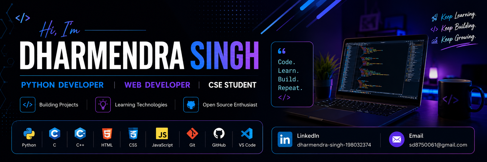

<p align="center">
  
</p>


<h1 align="center">Hi 👋, I'm Dharmendra Kumar Singh</h1>


<h3 align="center">
🚀 Python Developer | AI Enthusiast | Future Software Engineer
</h3>

<p align="center">

</p>


## 👨‍💻 About Me

🎓 Diploma Student in **Computer Science Engineering**

💻 Passionate about **Full Stack Web Development** and **Python Programming**

🚀 Building modern web applications with **React, Next.js, Node.js, Express.js, MongoDB, MySQL, and Firebase**

🤖 Currently learning **Artificial Intelligence, Machine Learning, TypeScript, and Docker**

🤝 Open to **internships**, **open-source contributions**, and exciting development opportunities.


## 🧠 Current Focus

💻 **Backend Development:** Python (Flask), REST APIs  
🤖 **AI & ML:** Machine Learning Fundamentals  
🗄️ **Databases:** MySQL • MongoDB • Firebase Realtime Database • Supabase (PostgreSQL)  
🌐 **Open Source:** Learning and Contributing to Projects  
📈 **Problem Solving:** Data Structures & Algorithms  
☁️ **Learning:** Docker • TypeScript • Next.js


## 🛠️ Tech Stack

<div align="center">

<table>

<tr>
<td align="center"><br>HTML</td>
<td align="center"><br>CSS</td>
<td align="center"><br>JavaScript</td>
<td align="center"><br>React</td>
<td align="center"><br>java</td>
<td align="center"><br>Next.js</td>
<td align="center"><br>Node.js</td>
<td align="center"><br>firebase</td>
<td align="center"><br>Express</td>
</tr>

<tr>
<td align="center"><br>MongoDB</td>
<td align="center"><br>php</td>
<td align="center"><br>MySQL</td>
<td align="center"><br>Git</td>
<td align="center"><br>GitHub</td>
<td align="center"><br>vercel</td>
<td align="center"><br>Postman</td>
<td align="center"><br>VS Code</td>
<td align="center"><br>Python</td>
</tr>

</table>

</div>


### 🔥 Additional Tools & Skills

- ⚡ **Convex** (Backend-as-a-service, real-time DB)
- 🔐 **Clerk** (Authentication & user management)
- 🌐 **REST APIs & HTTP**
- 📊 **Data Handling (Pandas, basic analytics)**
- 🧠 **Prompt Engineering & AI Tools**
- 📦 **API Integration & Debugging**


## 📊 GitHub Analytics

<p align="center">


<br>


</p>


## 🔥 GitHub Streak

<p align="center">


  
</p>


## 🏆 Achievements

<p align="center">
  
  <h2 align="center">GitHub Profile Trophy</h2>
  <br>


</p>


## 🌱 Learning Roadmap

### 🐍 Python

```text
Python
├── Python Basics
├── Advanced Python
├── OOP
├── Flask / Django / FastAPI
├── REST APIs
├── Backend Development
└── 🚀 Projects
    ├── Calculator
    ├── Student Management System
    ├── Expense Tracker
    └── REST API
```

### ☕ Java

```text
Java
├── Core Java
├── OOP
├── Collections
├── Exception Handling
├── Multithreading
├── Spring Boot
├── REST APIs
└── 🚀 Projects
    ├── Banking Management System
    ├── Library Management System
    ├── Quiz Application
    └── E-Commerce API
```

### 🟨 JavaScript

```text
JavaScript
├── JavaScript Basics
├── ES6+
├── DOM & Events
├── Async JavaScript
├── Fetch API
├── JSON
└── 🚀 Projects
    ├── Calculator
    ├── To-Do App
    ├── Weather App
    └── Quiz App
```

### 🌐 Web Development

```text
Web Development
├── HTML
├── CSS
├── JavaScript
├── Responsive Design
├── Bootstrap / Tailwind
└── 🚀 Projects
    ├── Personal Portfolio
    ├── Landing Page
    ├── Blog Website
    └── E-Commerce Website
```

### ⚛️ React

```text
React
├── Components
├── Props & State
├── Hooks
├── React Router
├── Context API
├── Redux
├── Next.js
└── 🚀 Projects
    ├── Portfolio
    ├── Expense Tracker
    ├── Movie App
    └── E-Commerce App
```

### 🟢 Node.js

```text
Node.js
├── Node.js Basics
├── npm
├── Express.js
├── REST APIs
├── Authentication
├── MongoDB
└── 🚀 Projects
    ├── Authentication API
    ├── Blog API
    ├── Chat Application
    └── E-Commerce API
```

### 🗄️ SQL & Databases

```text
Databases
├── SQL
├── MySQL
├── PostgreSQL
├── SQLite
├── MongoDB
├── Database Design
└── 🚀 Projects
    ├── Student Database
    ├── Library Database
    ├── Banking Database
    └── E-Commerce Database
```

### 🤖 AI / ML

```text
AI / ML
├── NumPy
├── Pandas
├── Data Visualization
├── Machine Learning
├── Scikit-Learn
├── Deep Learning
├── AI APIs
├── Prompt Engineering
└── 🚀 Projects
    ├── House Price Prediction
    ├── Spam Detection
    ├── Recommendation System
    └── AI Chatbot
```

### ⚙️ DevOps

```text
DevOps
├── Linux
├── Git & GitHub
├── Docker
├── CI/CD
├── Cloud
└── 🚀 Projects
    ├── Dockerized Web App
    ├── CI/CD Pipeline
    ├── Cloud Deployment
    └── Full-Stack Deployment
```

### 🔧 C / C++

```text
C / C++
├── Programming Basics
├── Pointers
├── Functions
├── OOP
├── Data Structures
├── Algorithms
└── 🚀 Projects
    ├── Calculator
    ├── Student Management System
    ├── Banking System
    └── Library Management System
```

### 📱 Mobile Development

```text
Mobile Development
├── Android
├── Kotlin
├── Flutter
├── Dart
├── React Native
└── 🚀 Projects
    ├── Notes App
    ├── Expense Tracker
    ├── Weather App
    └── E-Commerce App
```

### 🚀 Full Stack Development

```text
Full Stack
├── Frontend
│   ├── HTML / CSS
│   ├── JavaScript
│   └── React / Next.js
│
├── Backend
│   ├── Python / Flask
│   ├── Node.js / Express
│   └── REST APIs
│
├── Database
│   ├── MySQL
│   ├── PostgreSQL
│   └── MongoDB
│
├── DevOps
│   ├── Git & GitHub
│   ├── Docker
│   └── Cloud
│
└── 🚀 Projects
    ├── Social Media App
    ├── E-Commerce Platform
    ├── Learning Management System
    └── AI-Powered Web Application
```

### 🎯 Overall Roadmap

```text
Programming
│
├── 🐍 Python ──────────── Backend / AI
├── ☕ Java ────────────── Enterprise Backend
├── 🟨 JavaScript ──────── Web Development
├── ⚛️ React ───────────── Frontend
├── 🟢 Node.js ─────────── Backend
├── 🗄️ SQL ─────────────── Databases
├── 🤖 AI / ML ─────────── Artificial Intelligence
├── ⚙️ DevOps ──────────── Deployment
├── 🔧 C / C++ ─────────── DSA / Systems
├── 📱 Mobile ──────────── App Development
│
└── 🚀 Build → Deploy → Improve → Repeat
```


## 🚀 Featured Projects

<p align="center">
  <a href="https://github.com/dharmendra-developer/Arogya-Bot">
    
  </a>
  <a href="https://github.com/dharmendra-developer/Cab-Booking-System">
    
  </a>
</p>

<table>
<tr>
<td width="50%" valign="top">

### 🌿 ArogyaBot

**AI-Powered Rural Health Assistant**

An AI-focused project designed to provide accessible health assistance through technology.

**Tech Stack**


<a href="https://github.com/dharmendra-developer/Arogya-Bot">

</a>

</td>

<td width="50%" valign="top">

### 🚖 Cab Booking System

**Python + MySQL**

A booking management system with user management, booking operations and database integration.

**Tech Stack**


<a href="https://github.com/dharmendra-developer/Cab-Booking-System">

</a>

</td>
</tr>

<tr>
<td width="50%" valign="top">

### 💰 Expense Tracker

**Expense Management Application**

A project for tracking and managing personal expenses.

**Tech Stack**


<a href="https://github.com/dharmendra-developer/Expense-Tracker">

</a>

</td>

<td width="50%" valign="top">

### 🏫 Smart Campus Management

**Campus Management Platform**

A smart campus concept combining student and academic management features.

**Tech Stack**


<a href="https://github.com/dharmendra-developer/Smart_Campus_Management_System">

</a>

</td>
</tr>

<tr>
<td width="50%" valign="top">

### 👨‍🎓 Student Management System

**Student Record Management**

A system for managing student information and records.

**Tech Stack**


<a href="https://github.com/dharmendra-developer/Student_Management_System">

</a>

</td>

<td width="50%" valign="top">

### 📚 Library Management System

**Library Automation**

A project for managing books, records and library operations.

**Tech Stack**


<a href="https://github.com/dharmendra-developer/Labrory_Management_System">

</a>

</td>
</tr>

<tr>
<td width="50%" valign="top">

### 📊 Student Result System

**Result Management**

A student result management project for handling academic results.

**Tech Stack**


<a href="https://github.com/dharmendra-developer/Student_Result_System">

</a>

</td>

<td width="50%" valign="top">

### 🔐 Login System

**Authentication Project**

A project demonstrating user login and authentication concepts.

**Tech Stack**


<a href="https://github.com/dharmendra-developer/Login_System">

</a>

</td>
</tr>

<td width="50%" valign="top">

### 📈 Student Performance Prediction

**Machine Learning**

A machine-learning project focused on student performance prediction.

**Tech Stack**


<a href="https://github.com/dharmendra-developer/Student-Profermance-Prediction">

</a>

</td>
</tr>

</tr>

</table>


## **🌐 Connect With Me**

<p align="center">

<a href="https://github.com/dharmendra-developer">

</a>
<a href="https://www.linkedin.com/in/dharmendra-singh-198032374">

</a>
<a href="mailto:Sd8750061@gmail.com">

</a>
<a href="https://www.instagram.com/dharmendra_developer/">

</a>
<a herf="https://www.facebook.com/dharmendra.kumar.singh.125790">

</a>
</p>


## 👀 Profile Visitors

<p align="center">

</p>


## 🐍 Contribution Snake  


## 💡 Developer Quote

> "First, solve the problem. Then, write the code."


<div align="center>
### **Mindset**
**"Execution Beats intention Always."**
</div>


⭐ **If you like my work, give a star to my repositories!**


🧠 Mindset

<div align="#">

⚡ Execution Beats Intention — Always.

Build • Learn • Improve • Repeat

</div>


⭐ Support My Work

<p align="center">

If you like my projects, consider giving ⭐ to my repositories and following me on GitHub!

<br><br>

Thanks for visiting my profile! 🚀
